# AI Business Process Discovery Agent

> A local-first, governed RAG application that turns organisational documents into cited business-process insights—and stops safely when the evidence or output is not trustworthy enough.

Users upload process material such as policies, standard operating procedures, audit findings, spreadsheets, and operational notes. The application extracts and indexes that evidence, retrieves the most relevant content for a question, and runs a structured process analysis. Every model-dependent stage is governed with **VSL Core** and **VSL LangGraph**, and every governance decision is recorded in a hash-chained `VerbaLedger`.

## Why this project exists

Operational knowledge is often scattered across documents and held by different teams. Understanding a process end to end—who owns each step, where work waits, which controls are weak, and what can be automated—can require lengthy manual review.

This application provides an evidence-backed first draft for process owners. It produces:

- a documented process map with roles, systems, handoffs, decisions, inputs, and outputs;
- ranked bottlenecks;
- operational and control risks, without presenting legal or regulatory conclusions;
- automation opportunities with human-review requirements where appropriate; and
- an executive synthesis with source citations.

It deliberately does **not** claim to establish what people do in reality. It describes what the supplied documents support and keeps gaps, assumptions, and denied runs visible.

## Architecture

```mermaid
flowchart LR
    A["Organisation documents\nPDF · DOCX · XLSX · CSV · TXT"] --> B["Ingestion\nextract · normalise · chunk · embed · index"]
    Q["Business question"] --> C["Project-scoped\nsemantic retrieval"]
    B --> C
    C --> D["LangGraph StateGraph\n5 analysis stages"]
    D --> E["VSL Core + VSL LangGraph\npre-nodes and invariants"]
    E -->|"allowed"| F["Cited process analysis\n+ audit report"]
    E -->|"denied"| G["Safe terminal state\n+ denial record"]
    E --> H["VerbaLedger\nhash-chained events"]
```



### Application stack

| Layer | Implementation |
| --- | --- |
| Frontend | React 18, TypeScript, Vite, Tailwind CSS, TanStack Query |
| API and persistence | FastAPI, SQLAlchemy, SQLite (default) |
| Document intelligence | PyMuPDF, `python-docx`, `openpyxl`, `pandas` |
| RAG | paragraph-aware chunking, embeddings, semantic retrieval, in-memory vector store |
| AI providers | Ollama (`llama3.2`) by default; OpenAI-compatible provider and deterministic mock provider supported |
| Embeddings | Ollama `nomic-embed-text` by default; deterministic local provider for tests |
| Orchestration | LangGraph `StateGraph` with async governed nodes |
| Governance | `super-semantics-vsl` / VSL Core, `vsl-langgraph`, `VerbaLedger` |
| Quality checks | Pytest, Vitest, frontend production build, OpenAPI-to-TypeScript contract verification |

## End-to-end workflow

### 1. Ingestion pipeline

When a user uploads a document, the backend runs the following project-scoped pipeline:

```text
Upload file
  → extract text and metadata
  → normalise text
  → paragraph-aware chunking
  → create embeddings
  → store chunks, metadata, and vectors
  → mark document Ready
```

Supported formats: `.pdf`, `.docx`, `.txt`, `.csv`, and `.xlsx` (maximum upload size: 25 MB by default).

Chunks use a configurable default of **1,000 characters** with **200 characters of overlap**. Chunk metadata retains document and project identifiers, enabling provenance and project isolation at retrieval time.

### 2. Retrieval pipeline

When a user submits a business question, the RAG service searches only the selected project's indexed documents:

```text
Question
  → question embedding
  → semantic similarity search
  → top relevant chunks (default: 5)
  → source-aware evidence context
```

The evidence context is passed to the analysis workflow. A run with no usable source context is routed directly to `INSUFFICIENT_EVIDENCE`; the LLM is not used to fill that gap.

### 3. Governed LangGraph workflow

The workflow uses a shared `ProcessDiscoveryState` containing the question, retrieval result, each stage output, citations, workflow status, governance decisions, and terminal-state information.

The five sequential LLM stages are:

1. **Process discovery** — identifies the trigger, ordered steps, roles, systems, decisions, handoffs, inputs, outputs, and evidence gaps.
2. **Bottleneck analysis** — identifies evidence-supported waiting time, manual handoffs, duplicated work, repeated approvals, rework, and system switching.
3. **Risk analysis** — identifies operational and control concerns while preventing legal, regulatory, or compliance conclusions.
4. **Automation analysis** — distinguishes appropriate automation from work that needs human judgement or is unsafe to automate.
5. **Final synthesis** — creates one source-grounded executive analysis from the validated stage outputs.

The backend runs analyses in a FastAPI background task because five sequential model calls can take several minutes. The frontend polls the run endpoint and displays stage progress.

## VSL-native governance

Governance is part of the execution path, not a report generated after the model has finished.

```text
Retrieve evidence
  → PreNode checks whether the next LLM call is permitted
  → LLM analysis stage
  → Invariant validates the output before downstream use
  → continue, or route to a safe terminal state
```

### Five VSL Core PreNodes

Each LLM action is protected by a compiled `PreNode` through `vsl_langgraph.gated_node`:

| Construct | Protects | What it requires |
| --- | --- | --- |
| `process_discovery_pre_node` | Process discovery | Scoped, usable RAG evidence |
| `bottleneck_analysis_pre_node` | Bottleneck analysis | Grounded process findings |
| `risk_analysis_pre_node` | Risk analysis | Admissible evidence for operational risk analysis |
| `automation_analysis_pre_node` | Automation analysis | Process and bottleneck evidence |
| `final_synthesis_pre_node` | Final synthesis | Earlier analyses passed their invariants |

### Six output invariants

Outputs are validated before downstream stages rely on them:

| Invariant | Purpose |
| --- | --- |
| `evidence_reference_invariant` | Ensures process findings reference available evidence |
| `process_analysis_invariant` | Validates process-analysis scope and structure |
| `bottleneck_analysis_invariant` | Validates bottleneck findings |
| `risk_scope_invariant` | Restricts risks to operational/control scope and rejects explicit legal conclusions |
| `automation_safety_invariant` | Requires appropriate human review and rejects unsupported autonomous execution |
| `final_analysis_invariant` | Validates grounding, citations, assumptions, evidence gaps, and unresolved denials |

The workflow also has deterministic readiness monitors. They inspect source availability, citation score, source/project scope, and context readiness; they do not call an LLM or alter model weights, prompts, logits, or sampling.

### Safe terminal states

| Terminal state | Meaning |
| --- | --- |
| `INSUFFICIENT_EVIDENCE` | No usable, relevant document evidence was retrieved |
| `UNSUPPORTED_FINDINGS` | A generated output failed an evidence-grounding invariant |
| `GOVERNANCE_BLOCKED` | A required governance gate denied automated continuation |
| `HUMAN_REVIEW_REQUIRED` | Further automation must stop pending authorised human judgement |

A terminal state stops automated transitions for that invocation. The current application has no approval UI or re-enablement API; it does not claim that a denied run has been human-approved or automatically retried.

## Audit trail and traceability

The application wraps an injected `VerbaLedger` in `ProcessDiscoveryGovernanceLedger`.

For allowed gates it records monitor, pre-node, and verification events. For denials it records the relevant events plus a terminal entry and a serialisable denial summary. Stored payloads contain safe metadata such as node name, decision outcome, source count, confidence when available, and terminal state. They exclude document text, prompts, embeddings, API keys, stack traces, and provider exceptions.

The default local ledger file is:

```text
governance_ledger.jsonl
```

It is append-only and hash-chained. The Governance & Audit screen and `GET /api/v1/analyses/{run_id}/governance` expose governance decisions, the related ledger entries, integrity verification, a checkpoint hash, audit checks, and a certificate hash when a certificate can be issued.

The ledger detects tampering within its stored chain. It is not externally anchored or independently immutable storage, and therefore should not be described as a complete compliance system.

## Running locally

### Prerequisites

- Python 3.10+
- Node.js 20+
- npm
- [Ollama](https://ollama.com/) for the default local LLM and embedding configuration

Start Ollama and download the required models:

```bash
ollama serve
ollama pull llama3.2
ollama pull nomic-embed-text
```

### Backend

```bash
cd backend
python -m venv .venv

# macOS / Linux
source .venv/bin/activate

# Windows PowerShell
# .\.venv\Scripts\Activate.ps1

pip install -r requirements.txt
```

Copy the environment template before starting the server:

```powershell
# Windows PowerShell
Copy-Item .env.example .env
```

```bash
# macOS / Linux
cp .env.example .env
```

```bash
uvicorn app.main:app --reload --port 8000
```

Backend API documentation: <http://localhost:8000/docs>

### Frontend

In another terminal:

```bash
cd frontend
npm install
```

Copy the environment template before starting the development server:

```powershell
# Windows PowerShell
Copy-Item .env.example .env
```

```bash
# macOS / Linux
cp .env.example .env
```

```bash
npm run dev
```

Open <http://localhost:5173>.

### Deterministic offline workflow test

To exercise the workflow and governance screens without a live model, set this in `backend/.env`:

```env
LLM_PROVIDER=mock
```

The mock provider is stage-aware and is intended for smoke testing. Its results are placeholders, not business findings.

> **Embedding-provider note:** `EMBEDDING_PROVIDER=local` is deterministic and useful in unit tests, but it hashes text rather than modelling semantic meaning. Its similarity scores are not suitable for a real analysis run and can cause the evidence gate to reject valid documents. Use the Ollama embedding provider for meaningful retrieval.

## API surface

Base path: `/api/v1`

| Method | Endpoint | Purpose |
| --- | --- | --- |
| `GET` | `/health` | Service status and provider configuration |
| `GET` | `/dashboard` | Project aggregates and recent activity |
| `GET`, `POST` | `/projects` | List or create projects |
| `GET`, `PUT`, `DELETE` | `/projects/{project_id}` | Read, update, or delete a project |
| `GET`, `POST` | `/projects/{project_id}/documents` | List or upload documents |
| `DELETE` | `/documents/{document_id}` | Delete a document |
| `POST` | `/documents/{document_id}/reindex` | Retry extraction and indexing |
| `GET`, `POST` | `/projects/{project_id}/analyses` | List or begin a governed analysis |
| `GET` | `/analyses/{run_id}` | Retrieve analysis status and results |
| `GET` | `/analyses/{run_id}/governance` | Retrieve governance events, ledger entries, and audit report |
| `GET` | `/governance/catalogue` | Retrieve the compiled governance rulebook |

## Testing and contract checks

```bash
# Backend
cd backend
pytest

# Frontend
cd frontend
npm test
npm run build

# From the repository root, with the backend environment active
python verify_types.py
```

`verify_types.py` generates the FastAPI OpenAPI schema in-process and compares it with `frontend/src/types/api.ts`. It exits non-zero if a TypeScript interface or enum drifts from the backend contract, so it can be used in CI.

## Project structure

```text
backend/
  app/
    api/                       FastAPI routes
    document_processing/       extraction, normalisation, metadata
    rag/                       chunking, embeddings, retrieval, vector store
    llm/                       Ollama, OpenAI-compatible, and mock providers
    workflows/process_discovery/
                               LangGraph state, nodes, graph, and routing
    governance/process_discovery/
                               VSL gates, invariants, policies, monitors, ledger wrapper
    services/                  application services and background-run handling
  tests/                       API, RAG, LLM, workflow, and governance tests
  docs/vsl-native-process-discovery.md
frontend/
  src/
    pages/                     dashboard, projects, results, governance screens
    features/                  project, document, and analysis UI
    api/                       typed API client and endpoints
verify_types.py                OpenAPI ↔ TypeScript contract check
```

## Current scope and next steps

This project demonstrates governed document intelligence and a production-oriented application shape. Important next steps for a multi-user production deployment include:

- replace the default SQLite and in-memory vector store with managed, durable services;
- add authentication, role-based access, document-level authorisation, and tenant isolation;
- add an authorised human-review and re-enablement workflow;
- add external ledger anchoring, retention controls, and monitoring;
- evaluate retrieval quality and answer grounding against a labelled business-process test set; and
- deploy the frontend, API, model service, and background processing with CI/CD, observability, and secret management.

## Honest assurance boundary

VSL PreNodes execute before protected RAG-dependent LLM requests. Output invariants run after generation and before downstream reliance. These controls make the workflow more traceable and constrain unsafe continuation; they do not prove that an LLM interpreted a document correctly or that a business conclusion is true. Final findings should be reviewed by the relevant process owner before operational decisions are made.