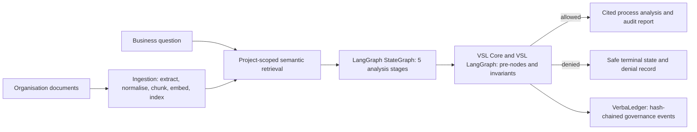

# AI Business Process Discovery Agent

> A local-first, governed RAG application that turns organisational documents into cited business-process insights - and stops safely when evidence or outputs are not trustworthy enough.

The application helps organisations understand processes documented across policies, SOPs, audit reports, spreadsheets, and operational notes. It extracts and indexes this evidence, retrieves the most relevant content for a question, and runs structured analysis through a governed LangGraph workflow.

Every model-dependent stage is controlled with VSL Core and VSL LangGraph. Governance decisions are recorded in a hash-chained VerbaLedger.

## What it delivers

- Process map: steps, owners, systems, handoffs, decisions, inputs, and outputs.
- Bottleneck analysis: waiting time, manual handoffs, rework, duplicate effort, and system switching.
- Operational and control risk analysis: no legal, regulatory, or compliance conclusions.
- Automation opportunities: identifies suitable automation and work requiring human judgement.
- Executive synthesis: a final evidence-grounded summary with source citations.

The output is a documented, evidence-backed first draft for process owners. It does not claim to prove what people do in reality or that an LLM interpretation is correct.

## Architecture



## Technology stack

| Layer | Technology |
| --- | --- |
| Frontend | React 18, TypeScript, Vite, Tailwind CSS, TanStack Query |
| Backend | FastAPI, SQLAlchemy, SQLite (default) |
| Document processing | PyMuPDF, python-docx, openpyxl, pandas |
| RAG | Paragraph-aware chunking, embeddings, semantic retrieval, vector store |
| LLM | Ollama with llama3.2 by default; OpenAI-compatible and mock providers supported |
| Embeddings | Ollama nomic-embed-text by default; deterministic local provider for tests |
| Orchestration | LangGraph StateGraph with asynchronous governed nodes |
| Governance | super-semantics-vsl, vsl-langgraph, VerbaLedger |
| Quality | Pytest, Vitest, production build, OpenAPI-to-TypeScript contract verification |

## End-to-end flow

### 1. Document ingestion

Supported file types are PDF, DOCX, TXT, CSV, and XLSX. Files can be up to 25 MB by default.

```text
Upload file
  -> extract text and metadata
  -> normalise text
  -> paragraph-aware chunking
  -> create embeddings
  -> store chunks, metadata, and vectors
  -> mark document Ready
```

The default chunk size is 1,000 characters with 200 characters of overlap. Metadata retains the document and project identifiers, preserving source provenance and project isolation.

### 2. Retrieval pipeline

```text
Business question
  -> create a question embedding
  -> semantic similarity search over the selected project
  -> retrieve the top relevant chunks (default: 5)
  -> assemble source-aware evidence context
```

If the system has no usable source context, it routes directly to `INSUFFICIENT_EVIDENCE`. The LLM is not used to fill missing evidence.

### 3. Governed analysis workflow

The LangGraph `ProcessDiscoveryState` carries the question, evidence, stage outputs, citations, workflow status, governance decisions, and terminal-state information.

1. **Process discovery** - identifies triggers, steps, roles, systems, decisions, handoffs, inputs, outputs, and evidence gaps.
2. **Bottleneck analysis** - identifies supported waiting time, manual handoffs, duplicate work, repeated approvals, rework, and system switching.
3. **Risk analysis** - identifies operational and control concerns without legal or regulatory conclusions.
4. **Automation analysis** - separates suitable automation from work requiring human judgement or unsuitable for automation.
5. **Final synthesis** - creates one grounded executive analysis from earlier validated outputs.

Analyses run in a FastAPI background task because multiple sequential LLM calls can take several minutes. The React frontend polls the run endpoint and displays progress.

## VSL-native governance

Governance is part of the execution path, not a report added after generation.

```text
Retrieve evidence
  -> PreNode checks whether the next LLM call is permitted
  -> LLM analysis stage
  -> Invariant validates output before downstream use
  -> continue or route to a safe terminal state
```

### PreNodes

| Construct | Protects | Requirement |
| --- | --- | --- |
| `process_discovery_pre_node` | Process discovery | Scoped, usable RAG evidence |
| `bottleneck_analysis_pre_node` | Bottleneck analysis | Grounded process findings |
| `risk_analysis_pre_node` | Risk analysis | Admissible evidence for operational risk analysis |
| `automation_analysis_pre_node` | Automation analysis | Process and bottleneck evidence |
| `final_synthesis_pre_node` | Final synthesis | Earlier analyses passed their invariants |

### Output invariants

| Invariant | Purpose |
| --- | --- |
| `evidence_reference_invariant` | Ensures process findings reference available evidence |
| `process_analysis_invariant` | Validates process-analysis scope and structure |
| `bottleneck_analysis_invariant` | Validates bottleneck findings |
| `risk_scope_invariant` | Limits findings to operational/control risk and rejects explicit legal conclusions |
| `automation_safety_invariant` | Requires appropriate human review and rejects unsupported autonomous execution |
| `final_analysis_invariant` | Validates grounding, citations, assumptions, evidence gaps, and unresolved denials |

Readiness monitors inspect source availability, citation score, project scope, and context readiness. They do not call an LLM or modify model prompts, weights, logits, or sampling.

### Safe terminal states

| Terminal state | Meaning |
| --- | --- |
| `INSUFFICIENT_EVIDENCE` | No usable, relevant source evidence was retrieved |
| `UNSUPPORTED_FINDINGS` | Generated output failed an evidence-grounding invariant |
| `GOVERNANCE_BLOCKED` | A required governance gate denied automated continuation |
| `HUMAN_REVIEW_REQUIRED` | Automated progression must stop pending authorised human judgement |

## Audit trail

`ProcessDiscoveryGovernanceLedger` records governance events through an injected `VerbaLedger`.

- Allowed gates record monitor, pre-node, and verification events.
- Denials record the relevant events, a terminal entry, and a serialisable denial summary.
- Stored payloads contain safe metadata only: node name, decision outcome, source count, confidence when available, and terminal state.
- Stored events exclude document content, prompts, embeddings, API keys, stack traces, and provider exceptions.

The default local ledger file is:

```text
governance_ledger.jsonl
```

The ledger is append-only and hash-chained. The Governance and Audit screen, and `GET /api/v1/analyses/{run_id}/governance`, return governance decisions, related ledger entries, integrity verification, checkpoint hash, audit checks, and a certificate hash when available.

The ledger detects tampering within its stored chain. It is not externally anchored, so it should not be described as a complete compliance system.

## Run locally

### Prerequisites

- Python 3.10+
- Node.js 20+
- npm
- Ollama

Start Ollama and download the models:

```bash
ollama serve
ollama pull llama3.2
ollama pull nomic-embed-text
```

### Backend

```powershell
cd backend
python -m venv .venv
.\.venv\Scripts\Activate.ps1
pip install -r requirements.txt
Copy-Item .env.example .env
uvicorn app.main:app --reload --port 8000
```

API documentation: <http://localhost:8000/docs>

### Frontend

```powershell
cd frontend
npm install
Copy-Item .env.example .env
npm run dev
```

Open <http://localhost:5173>.

### Offline smoke test

Set the following in `backend/.env` to run the workflow without a live LLM:

```env
LLM_PROVIDER=mock
```

The mock provider is stage-aware and intended for workflow testing. Its output is placeholder content, not business advice.

> `EMBEDDING_PROVIDER=local` is useful for deterministic unit tests only. It hashes text rather than modelling semantic meaning, so use the Ollama embedding provider for real analysis runs.

## API

Base path: `/api/v1`

| Method | Endpoint | Purpose |
| --- | --- | --- |
| GET | `/health` | Service status and provider configuration |
| GET | `/dashboard` | Project aggregates and recent activity |
| GET, POST | `/projects` | List or create projects |
| GET, PUT, DELETE | `/projects/{project_id}` | Read, update, or delete a project |
| GET, POST | `/projects/{project_id}/documents` | List or upload documents |
| DELETE | `/documents/{document_id}` | Delete a document |
| POST | `/documents/{document_id}/reindex` | Retry extraction and indexing |
| GET, POST | `/projects/{project_id}/analyses` | List or begin a governed analysis |
| GET | `/analyses/{run_id}` | Retrieve analysis status and results |
| GET | `/analyses/{run_id}/governance` | Retrieve governance events, ledger entries, and audit report |
| GET | `/governance/catalogue` | Retrieve the compiled governance rulebook |

## Quality checks

```powershell
# Backend
cd backend
pytest

# Frontend
cd ..\frontend
npm test
npm run build

# Repository root, with backend environment active
cd ..
python verify_types.py
```

`verify_types.py` compares FastAPI's generated OpenAPI schema against the TypeScript API interfaces and enums. It exits non-zero when the frontend and backend contracts drift, which makes it suitable for CI.

## Current scope and production next steps

The project demonstrates governed document intelligence with a production-oriented application design. A multi-user production deployment should next add:

- PostgreSQL and a durable vector store in place of local defaults;
- authentication, role-based access control, document authorisation, and tenant isolation;
- an authorised human-review and re-enablement workflow;
- external ledger anchoring, retention controls, monitoring, and alerting;
- retrieval and grounding evaluation against labelled business-process data; and
- CI/CD, observability, secret management, and managed background processing.

## Assurance boundary

VSL PreNodes execute before protected RAG-dependent LLM requests. Invariants execute after generation and before downstream reliance. They constrain unsafe continuation and improve traceability, but they do not prove that the model interpreted a document correctly or that a business conclusion is true. Process owners should validate findings before making operational decisions.
